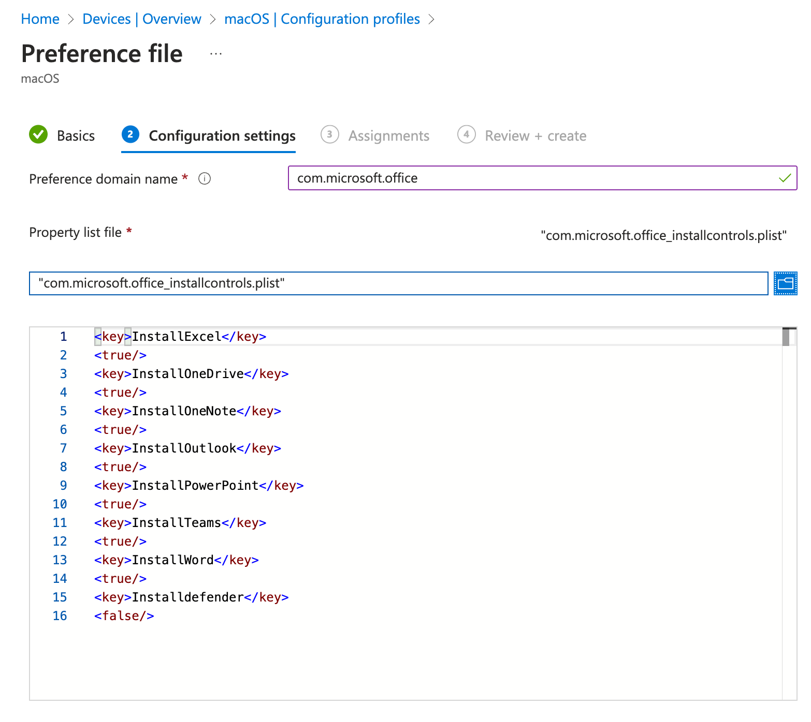

# Scripts for Microsoft Office for Mac

These scripts provide examples of how to use [Intune Shell Scripting](https://docs.microsoft.com/en-us/mem/intune/apps/macos-shell-scripts) to deploy Microsoft Office for Mac

Our recommended method of deploying Office for Mac is to use the [Apple Volume Purchase Program](https://docs.microsoft.com/en-us/mem/intune/apps/vpp-apps-ios) feature within Microsoft Intune. This can be used to individually select the Microsoft Office apps, they'll update automatically via the Mac App Store and automatically be cached if you have a local [Apple Asset Cache](https://support.apple.com/en-gb/guide/mac-help/mchl9388ba1b/mac). Additionally, this method is compatible with macOS 11's 'Managed App' feature coming to Big Sur.

Common scenarios where these scripts might be used:

- Needing to deploy a specific version of Office to some Macs
- Needing to control the update channel for some users (InsiderFast, Slow etc). Note that the apps deployed via VPP will always be the Production channel)
- Needing to control how the Microsoft Autoupdate App is configured. Note that apps delivered via VPP do not use MAU.
- Needing to remove OfficeBusinessPro
- Installing Outlook Support Tools (OutlookResetPreferences, OutlookResetRecentAddresses and OutlookAsDefaultMailClient)

## installOffice365Pro
This script will check the version of macOS and then install the latest available build of Office365, including Teams.

## installOffice365Pro_individual
This script loops through an array and will attempt to download and install the latest version of each app listed.

## MAU Plist
This folder contains sample plist files to be deployed via the Intune Preferences feature that will control how the Microsoft Autoupdate tool behaves

## Outlook
This folder contains some sample scripts that might be helpful for Outlook controls, such as setting it as the default e-Mail client.

## Install Controls (skip defender shim)
The Office Business Pro suite allows you to control which applications get installed via an [Intune managed preferences file](https://learn.microsoft.com/en-us/mem/intune/configuration/preference-file-settings-macos). You can start with the example **com.microsoft.office_installcontrols.plist** and modify as required.

You can find more information in the [Office for Mac deployment documentation](https://learn.microsoft.com/en-us/deployoffice/mac/preferences-office#excluding-apps)

You should set the Preference domain name for this managed preference file to : **com.microsoft.office**

Note: From Oct 2023 the Office Business Pro suite includes a shim for Defender. If you are not using Defender in your environment, you can prevent this from being installed by using this preference file with InstallDefender to to false. This changed was notified via [MC661225](https://admin.microsoft.com/AdminPortal/Home?ref=MessageCenter/:/messages/MC661225).

