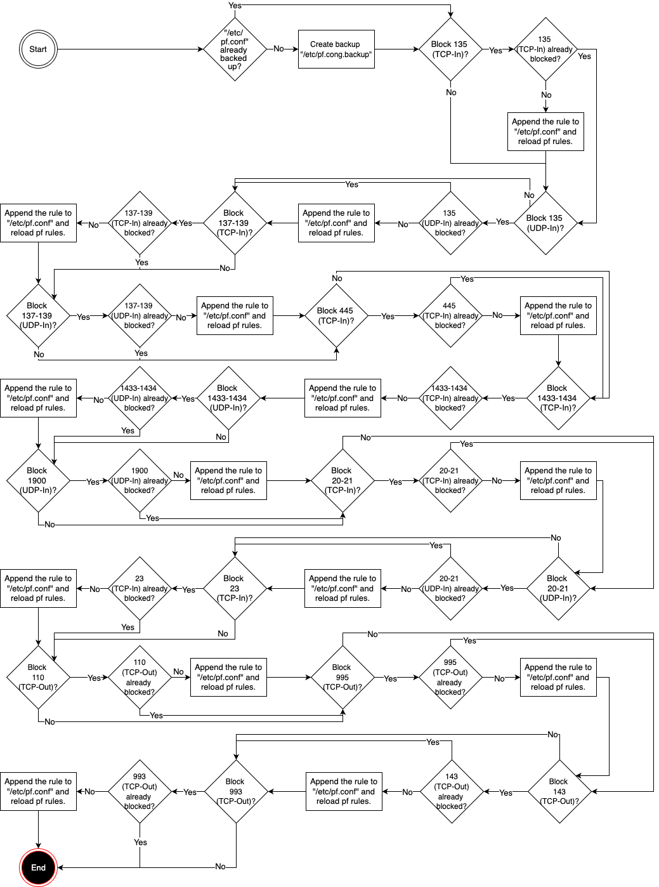

# Block Selected Port Numbers from macOS Firewall
This custom script blocks following port numbers from macOS Firewall:

 Port Number| Port | More information |
| -------- | ------- | -------- |
| 135 (TCP) | Remote Procedure Call (RPC) Endpoint Mapper service | Blocks Port Number 135 TCP used by Microsoft RPC, which can be exploited for remote code execution. |
| 135 (UDP) | Remote Procedure Call (RPC) Endpoint Mapper service | Blocks Port Number 135 UDP used by Microsoft RPC, which can be exploited for remote code execution. |
| 137-139 (TCP) | NetBIOS and Windows Internet Naming Service (WINS)| Blocks Port Numbers 137-139 TCP used by NetBIOS and WINS, which can be a vector for various attacks. |
| 137-139 (UDP) | NetBIOS and Windows Internet Naming Service (WINS) | Blocks Port Numbers 137-139 UDP used by NetBIOS and WINS, which can be a vector for various attacks. |
| 445 (TCP) | Microsoft SMB Domain Server / Microsoft-DS (Active Directory, Windows shares)| Blocks Port Number 445 TCP used by Microsoft SMB Domain Server / Microsoft-DS (Active Directory, Windows shares), which is often targeted by malware. |
| 1433-1434 (TCP) | Microsoft SQL Server | Blocks Port Numbers 1433-1434 TCP used by Microsoft SQL Server, which can be exploited if not properly secured. |
| 1433-1434 (UDP) | Microsoft SQL Server | Blocks Port Numbers 1433-1434 UDP used by Microsoft SQL Server, which can be exploited if not properly secured. |
| 3389 (TCP) | Remote Desktop Protocol (RDP) | Blocks Port Number 3389 TCP used by Remote Desktop Protocol (RDP), which is common target for brute force attacks. |
| 1900 (UDP) | SSDP, Universal Plug and Play (UPnP), Bonjour| Blocks Port Number 1900 UDP used by SSDP, Universal Plud and Play (UPnP) and Bonjour, which can be exploited for network discovery and attacks. |
| 20-21 (TCP) | FTP | Blocks Port Numbers 20-21 TCP used by FTP, which can be insecure if not properly configured. |
| 20-21 (UDP) | FTP | Blocks Port Numbers 20-21 UDP used by FTP, which can be insecure if not properly configured. |
| 23 (TCP) | Telnet | Blocks Port Numbers 23 TCP used by Telnet, which transmits data in plaintext and is insecure. |

> [!IMPORTANT]  
> Please note that there is a possibility that your Managed Mac-device may not use some of these port numbers or services above. Some of the services may also heavily related only to Windows-environment e.g. Remote Procedure Call (RPC) Endpoint Mapper service or Microsoft SQL Server. This script have been created in order to block these port numbers that are, in general, and usually used for malicious purposes.

> [!NOTE]  
> More information of port numbers used by Apple software products can be found [here](https://support.apple.com/en-us/103229) and [here](https://chadstechnoworks.com/wptech/os/mac_os_x_default_port_list.html)

## Prerequisities
**It is strongly recommended to deployed following script and policies to make sure that these services, that are using one of these port numbers, are not enabled and trying to calling to these blocked port numbers for nothing.**

| Port Numbers| Port | Link | More information
| -------- | ------- | -------- | -------- |
| 137-139 (TCP & UDP) | NetBIOS and Windows Internet Naming Service (WINS) | [Disable SMB 1, NetBIOS and netbiosd](https://github.com/microsoft/shell-intune-samples/tree/master/macOS/Config/Disable%20SMB%201%2C%20NetBIOS%20and%20netbiosd) | Disables NetBIOS and WINS. |
| 1900 (UDP) | Bonjour | [Disable Bonjour Advertising Services](https://github.com/microsoft/shell-intune-samples/tree/master/macOS/Config/Disable%20Bonjour%20Advertising%20Services) | Disables Bonjour Advertising Services. |


## Script workflow diagram

Here is the workflow of the script (click to enlarge the image):
 


 
## Script Settings

- Run script as signed-in user : No
- Hide script notifications on devices : Yes
- Script frequency : Every 1 day
- Number of times to retry if script fails : 3

## Log File

The log file will output to ***/Library/Logs/Microsoft/IntuneScripts/FirewallBlockPortNumbers/FirewallBlockPortNumbers.log*** by default. Exit status is either 0 or 1. To gather this log with Intune remotely take a look at  [Troubleshoot macOS shell script policies using log collection](https://docs.microsoft.com/en-us/mem/intune/apps/macos-shell-scripts#troubleshoot-macos-shell-script-policies-using-log-collection)

```
##############################################################
# Sat Mar  8 16:43:51 EET 2025 | Starting running of script FirewallBlockPortNumbers
############################################################

Sat Mar  8 16:43:51 EET 2025 | Backing up firewall configurations...
Sat Mar  8 16:43:51 EET 2025 | Done.
Sat Mar  8 16:43:51 EET 2025 | Disabling port 135/tcp permanently...
Sat Mar  8 16:43:51 EET 2025 | Port 135/tcp has been disabled permanently.
Sat Mar  8 16:43:51 EET 2025 | Disabling port 135/udp permanently...
Sat Mar  8 16:43:51 EET 2025 | Port 135/udp has been disabled permanently.
Sat Mar  8 16:43:51 EET 2025 | Disabling port 137/tcp permanently...
Sat Mar  8 16:43:51 EET 2025 | Port 137/tcp have been disabled permanently.
Sat Mar  8 16:43:51 EET 2025 | Disabling port 138/tcp permanently...
Sat Mar  8 16:43:51 EET 2025 | Port 138/tcp have been disabled permanently.
Sat Mar  8 16:43:51 EET 2025 | Disabling port 139/tcp permanently...
Sat Mar  8 16:43:51 EET 2025 | Port 139/tcp have been disabled permanently.
Sat Mar  8 16:43:51 EET 2025 | Disabling port 137/udp permanently...
Sat Mar  8 16:43:51 EET 2025 | Port 137/udp have been disabled permanently.
Sat Mar  8 16:43:51 EET 2025 | Disabling port 138/udp permanently...
Sat Mar  8 16:43:51 EET 2025 | Port 138/udp have been disabled permanently.
Sat Mar  8 16:43:51 EET 2025 | Disabling port 139/udp permanently...
Sat Mar  8 16:43:51 EET 2025 | Port 139/udp have been disabled permanently.
Sat Mar  8 16:43:51 EET 2025 | Disabling port 445/tcp permanently...
Sat Mar  8 16:43:51 EET 2025 | Port 445/tcp has been disabled permanently.
Sat Mar  8 16:43:51 EET 2025 | Disabling port 1433/tcp permanently...
Sat Mar  8 16:43:51 EET 2025 | Port 1433/tcp have been disabled permanently.
Sat Mar  8 16:43:51 EET 2025 | Disabling port 1434/tcp permanently...
Sat Mar  8 16:43:51 EET 2025 | Port 1434/tcp have been disabled permanently.
Sat Mar  8 16:43:51 EET 2025 | Disabling port 1433/udp permanently...
Sat Mar  8 16:43:52 EET 2025 | Port 1433/udp have been disabled permanently.
Sat Mar  8 16:43:52 EET 2025 | Disabling port 1434/udp permanently...
Sat Mar  8 16:43:52 EET 2025 | Port 1434/udp have been disabled permanently.
Sat Mar  8 16:43:52 EET 2025 | Disabling port 3389/tcp permanently...
Sat Mar  8 16:43:52 EET 2025 | Port 3389/tcp has been disabled permanently.
Sat Mar  8 16:43:52 EET 2025 | Disabling port 1900/udp permanently...
Sat Mar  8 16:43:52 EET 2025 | Port 1900/udp has been disabled permanently.
Sat Mar  8 16:43:52 EET 2025 | Disabling port 20/tcp permanently...
Sat Mar  8 16:43:52 EET 2025 | Port 20/tcp have been disabled permanently.
Sat Mar  8 16:43:52 EET 2025 | Disabling port 21/tcp permanently...
Sat Mar  8 16:43:52 EET 2025 | Port 21/tcp have been disabled permanently.
Sat Mar  8 16:43:52 EET 2025 | Disabling port 20/udp permanently...
Sat Mar  8 16:43:52 EET 2025 | Port 20/udp have been disabled permanently.
Sat Mar  8 16:43:52 EET 2025 | Disabling port 21/udp permanently...
Sat Mar  8 16:43:52 EET 2025 | Port 21/udp have been disabled permanently.
Sat Mar  8 16:43:52 EET 2025 | Disabling port 23/tcp permanently...
Sat Mar  8 16:43:52 EET 2025 | Port 23/tcp has been disabled permanently.
Sat Mar  8 16:43:52 EET 2025 | Done. Closing script...
```
